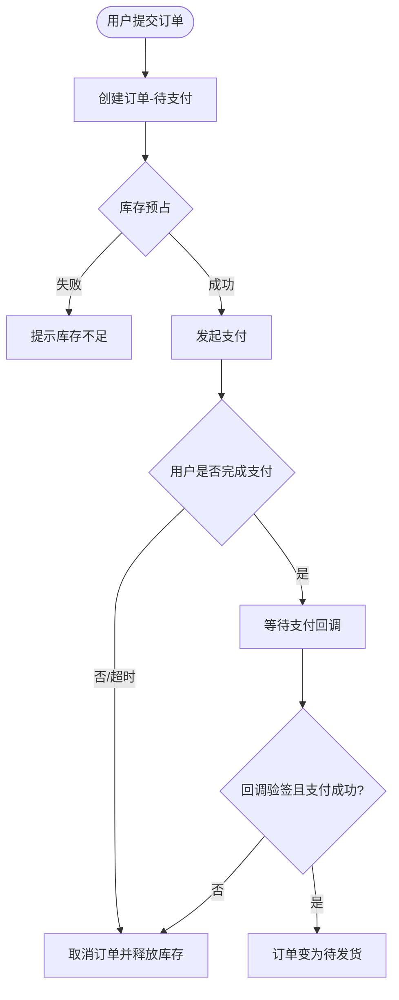
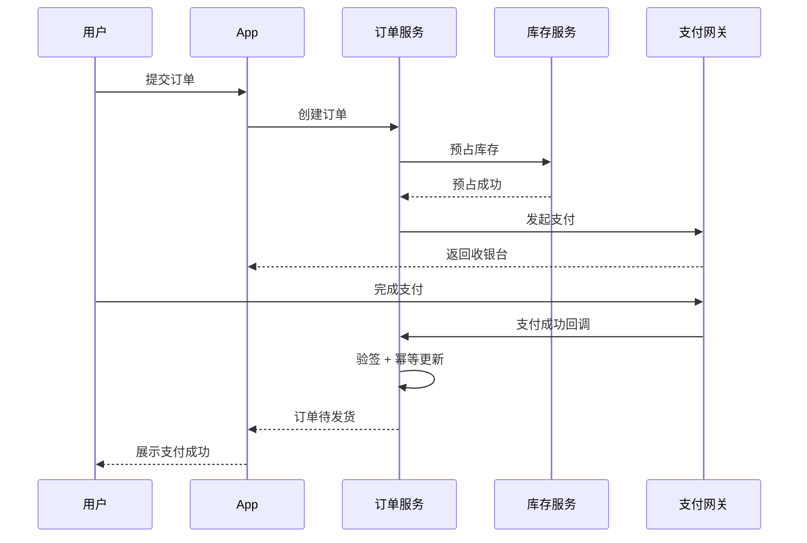
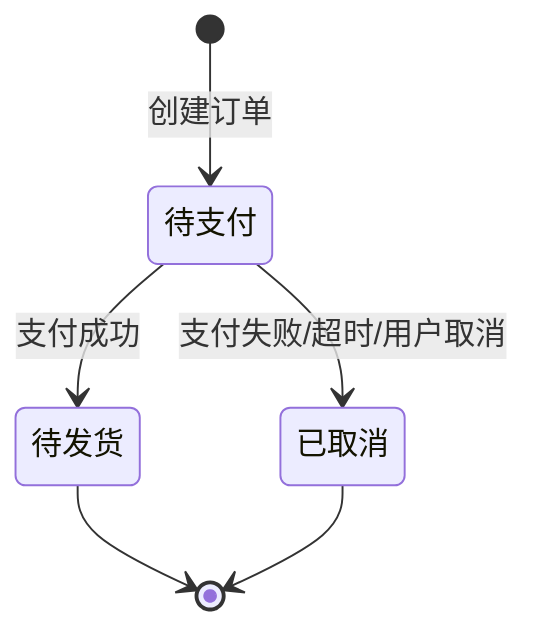

# 示例：电商下单支付

以下为 `@business-flow-mapper` 的典型输出样例（节选）。

---

# 电商下单支付 梳理

## 一句话总结

用户在 App 里下单并付款，系统先占库存、等支付网关确认钱到账后，才把订单变成「待发货」。

## 业务边界

- **场景**：用户在 App 购买实物商品
- **触发**：用户点击「提交订单并支付」
- **结果**：支付成功 → 订单待发货；支付失败/超时 → 订单取消、释放库存
- **不包含**：发货、退款、售后

## 角色与系统

| 角色/系统 | 职责 |
| --- | --- |
| 用户 | 选商品、提交订单、完成支付 |
| App | 展示页面、调用后端、跳转收银台 |
| 订单服务 | 创建订单、更新状态、协调库存 |
| 库存服务 | 预占/释放库存 |
| 支付网关 | 发起支付、异步回调通知结果 |
| 订单 DB | 持久化订单与支付状态 |

## 关键术语

| 术语 | 白话解释 |
| --- | --- |
| 预占库存 | 先锁住库存，防止超卖，支付失败再还回去 |
| 支付回调 | 支付网关事后通知我们「钱是否到账」，不是用户点完就算成功 |
| 幂等 | 同一笔支付通知重复到达时，只处理一次 |

## 主链路（Happy Path）

1. 用户提交订单，App 调订单服务创建订单（待支付）。
2. 订单服务调用库存服务预占库存。
3. 订单服务向支付网关发起支付。
4. 用户在收银台完成支付。
5. 支付网关回调订单服务，确认支付成功。
6. 订单服务把订单改为「待发货」，通知下游履约。

## 分支与异常

| 场景 | 触发条件 | 处理方式 | 备注 |
| --- | --- | --- | --- |
| 库存不足 | 预占失败 | 创建订单失败，提示用户 | 事实 |
| 支付失败 | 网关返回失败 | 取消订单，释放库存 | 事实 |
| 支付超时 | 超过 30 分钟未支付 | 定时任务关单并释放库存 | 【推断】 |
| 重复回调 | 同一 payment_id 多次通知 | 幂等更新，忽略重复 | 【推断】 |

## 主流程图

## 交互时序图

## 状态流转图

## 关键链路速查

- 下单入口：`App → 订单服务.create`
- 成败分叉点：库存预占、支付回调验签
- 异步关键：支付网关回调，不是同步返回即成功
- 补偿路径：关单 + 库存释放

## 待确认问题

1. 支付超时关单是定时任务还是延迟 MQ？【推断为定时任务】
2. 回调幂等键是 `payment_id` 还是 `order_id`？
3. 预占库存失败时，是否已写入订单表？
