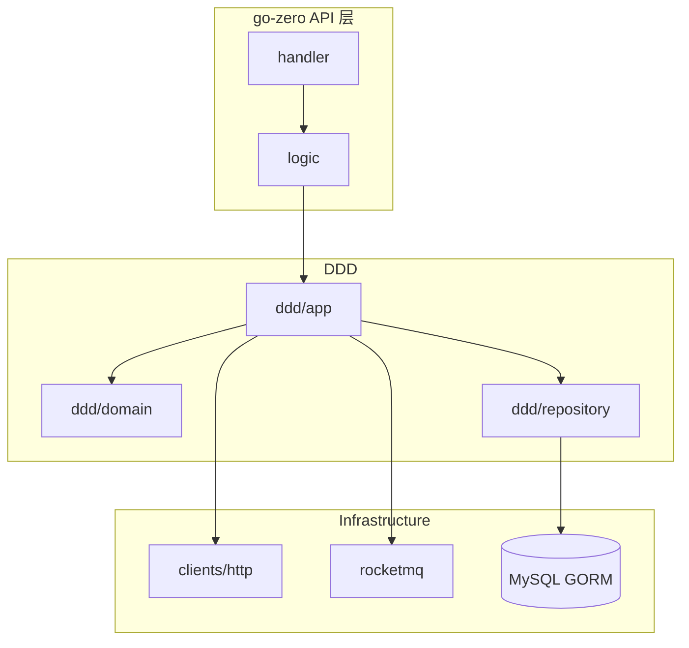

# 样例输出：finance-center-api 技术栈（节选）

> 本文件供 Agent 对齐输出风格；实际分析时须重新扫描，勿照搬路径。

---

# 技术栈分析报告：finance-center-api

**分析范围**：`/Users/.../finance-center-api`  
**置信度说明**：✅ 有明确证据 | ⚠️ 间接推断

## 总览

| 层级 | 选型 | 置信度 |
|------|------|--------|
| 语言 | Go 1.20+ | ✅ |
| Web 框架 | go-zero v1.6.x | ✅ |
| API 风格 | RESTful（类 REST，查询多用 POST） | ✅ |
| 服务通讯 | HTTP Client 为主，部分 gRPC | ✅ |
| 数据库 | MySQL | ✅ |
| ORM | GORM + gormx 扩展 | ✅ |
| 架构 | DDD 分层 | ✅ |
| 消息队列 | RocketMQ | ✅ |
| 缓存 | Redis（间接依赖） | ⚠️ |
| 定时任务 | cron + XXL-Job（主要在 jobs 仓库） | ✅ |
| 金额计算 | shopspring/decimal | ✅ |
| 集合 LINQ | ahmetb/go-linq/v3 | ✅ |
| 单测 | goconvey + mockey | ✅ |

---

## 详细说明

### 1. go-zero

- **是什么**：HTTP API 服务框架，负责路由、中间件、配置加载与 handler/logic 分层
- **检测依据**：`go.mod` → `github.com/zeromicro/go-zero v1.6.5`；`api/apifiles/*.api` 定义接口
- **举例**：`api/apifiles/settlementbill.api` — `@server(prefix: api/v1)` + `@handler SettlementBillAddHandler` + `post /settlementbill/add`
- **备注**：接口改动须先改 `.api`，再跑 `generate-types.sh` 生成 types/handler，禁止手改生成文件

### 2. RESTful API

- **是什么**：对外 HTTP JSON 接口，统一前缀 `api/v1`，按业务资源划分子路径
- **检测依据**：`.api` 中 `post/get/delete` 与路径 `/settlementbill/`、`/settlementbilldetails/`
- **举例**：
  - 新增：`post /settlementbill/add`
  - 查询：`post /settlementbill/query`（POST 传查询条件，非纯 REST GET）
  - 删除：`delete /settlementbilldetails/delete`
- **备注**：读操作大量用 POST 承载复杂查询体，属于国内 BFF/微服务常见「类 REST」风格

### 3. MySQL + GORM

- **是什么**：关系型持久化，Repository 层通过 GORM 访问 MySQL
- **检测依据**：`gorm.io/gorm`、`gorm.io/driver/mysql`；`ddd/repository/*/mysql.go`
- **举例**：`ddd/repository/contractrepository/mysql.go` — `NewMySQLRepository` 注入 `*gorm.DB` 实现仓储接口
- **备注**：另有 `gormx`、`gormextension` 公司内部封装

### 4. HTTP 服务间通讯

- **是什么**：调用 ERP、TMC、供应链等外部系统，以 HTTP Client 封装在 infrastructure 层
- **检测依据**：`ddd/infrastructure/clients/*/http.go`
- **举例**：`ddd/infrastructure/clients/supplychain/http.go`、`ddd/infrastructure/clients/erp/http.go`
- **备注**：与 go-zero 对外 REST 不同，这是**出站** HTTP 集成

### 5. DDD 分层架构

- **是什么**：按领域驱动设计拆分 domain / app / repository / infrastructure
- **检测依据**：顶层 `ddd/` 目录结构
- **举例**：
  - 领域模型：`ddd/domain/model/settlementcycleconfig.go`
  - 应用服务：`ddd/app/invoiceapply/`
  - 仓储：`ddd/repository/invoicebillrepository/`
  - 外部适配：`ddd/infrastructure/clients/`
  - 枚举：`ddd/enum/settlementbill.go`
- **备注**：`api/internal/logic/` 为 go-zero 接入层，编排 ddd 应用服务

### 6. shopspring/decimal

- **是什么**：高精度十进制，用于金额、票价、手续费，避免 float 精度问题
- **检测依据**：`go.mod` 依赖；model 与 client 中 `decimal.Decimal` 字段
- **举例**：`ddd/infrastructure/clients/tmc/pl/pl.go` — `decimal.NewFromString(ticket.TicketPrice)` 累加票价
- **备注**：财务/结算类项目标配

### 7. go-linq

- **是什么**：类 C# LINQ 的集合链式操作，简化 filter/map 转 DTO
- **检测依据**：`github.com/ahmetb/go-linq/v3`
- **举例**：`api/internal/logic/settlementbill/settlementbilladdlogic.go` — `linq.From(req.BillBrandRules).SelectT(...)` 转 `dto.BillBrandRule`
- **备注**：可与原生 `for` 混用，多见于 logic 层数据转换

### 8. 定时任务（关联 finance-center-jobs）

- **是什么**：结算计算、对账等离线作业；jobs 仓库用 cron 调度 + XXL-Job 执行器
- **检测依据**：`finance-center-jobs/go.mod` 含 `robfig/cron/v3`、`xxl-job-executor-go`
- **举例**：`finance-center-jobs/settlementjob/internal/logic/settlementjob.go` — `cron.New()` 管理 entry；`settlementjob/internal/xxljob/` 注册 XXL 任务
- **备注**：api 侧以 RocketMQ 消费、异步任务为主；重计算在 jobs

### 9. RocketMQ

- **是什么**：异步消息，解耦开票、结算通知等流程
- **检测依据**：`github.com/apache/rocketmq-client-go/v2`；`ddd/infrastructure/rocketmq/`
- **举例**：`ddd/infrastructure/rocketmq/consumer.go`

### 10. 设计模式（有代码证据）

| 模式 | 出现位置 | 用途 |
|------|----------|------|
| Repository | `ddd/repository/*/repository.go` + `mysql.go` | 持久化抽象，换存储不改领域 |
| State Machine | `ddd/repository/localmessagerepository/localmessagestatemachine.go` | 单据/任务状态流转 |
| Strategy | `ddd/app/train_ticket_invoice_issue_apply/standard_mode` vs `detailed_mode` | 按业务模式选开票策略 |
| Factory/Builder | `ddd/app/invoice_change_task_build/builder_*.go` | 组装复杂开票任务 |

---

## 架构简图

---

## 新人阅读顺序

1. `go.mod` — 依赖全貌
2. `api/api.api` + 任一 `apifiles/*.api` — 接口约定
3. `ddd/enum/` — 业务枚举
4. `ddd/domain/model/` — 核心实体
5. `api/internal/logic/` — 请求如何进领域
6. `ddd/repository/` — 数据如何落库
7. `finance-center-jobs/README` — 离线作业（若在同一工作区）
